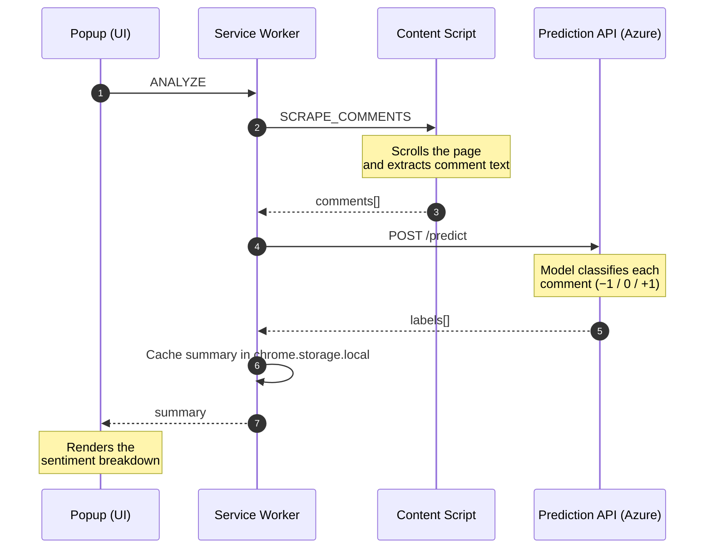

# YT Comment Sentiment — Chrome Extension

A Chrome extension (Manifest V3) that analyzes the sentiment of a YouTube video's comments and presents an at-a-glance breakdown — positive, neutral, and negative — directly in a popup.

This is the **browser client** for the [YouTube Comment Sentiment Analysis](https://github.com/Roy7721/yt_comment_analysis) MLOps project. The extension scrapes comments from the current video and sends them to a **live prediction API hosted on Azure Container Apps**, which serves a machine-learning model that classifies each comment as **−1 (negative)**, **0 (neutral)**, or **+1 (positive)**.

**🟢 Live API:** <https://yt-sentiment-api.ashysmoke-d4f578eb.koreacentral.azurecontainerapps.io>

No backend setup is required — install the extension and it works.

---

## Overview


> Trimmed. Most of the elapsed time is YouTube lazy-loading the comment section, not the
> API — once the comments are collected, prediction returns in well under a second.

When a user opens a YouTube video and clicks **Analyze comments**, the extension:

1. Scrolls the page to load comments,
2. Extracts the comment text,
3. Sends it to the prediction API,
4. Renders the aggregate sentiment — proportions per class, plus sample comments.

---

## How It Works

The extension follows the standard Manifest V3 separation of concerns:

| Component | File | Responsibility |
|-----------|------|----------------|
| Popup (UI) | `popup.html`, `popup.js` | Renders the interface, triggers analysis, and draws the results |
| Service worker | `background.js` | Orchestrates the flow; the only component with network access — sends comments to the API |
| Content script | `content.js` | Runs inside the YouTube page and scrapes comment text on request |

**Message flow:**



Each arrow is a single message; solid arrows are requests, dashed arrows are the replies that travel back along the same channel. Results are cached in `chrome.storage.local`, so they persist even if the service worker goes idle.

---

## Features

- One-click sentiment analysis of the current video's comments
- Automatic scrolling to load up to 100 comments (takes 30–60s — YouTube loads comments lazily)
- Aggregate breakdown (positive / neutral / negative) with proportions
- Representative sample comments for each sentiment class
- Self-contained, lightweight popup UI

---

## Prerequisites

**None — the extension works out of the box.** It calls a live prediction API:

➡️ <https://yt-sentiment-api.ashysmoke-d4f578eb.koreacentral.azurecontainerapps.io>

The model, API, and full MLOps pipeline live in the main repository:

➡️ **[yt_comment_analysis](https://github.com/Roy7721/yt_comment_analysis)**

> The API scales to zero when idle, so the first analysis after a quiet period takes a few extra seconds to wake it. Subsequent requests are immediate.

To develop against a local backend instead, set `FLASK_URL` in `background.js` to `http://127.0.0.1:5000/predict` — that host is already permitted in `manifest.json`.

---

## Installation

1. Clone this repository.
2. Open Chrome and navigate to `chrome://extensions`.
3. Enable **Developer mode** (top-right toggle).
4. Click **Load unpacked** and select this folder.
5. The **YT Comment Sentiment** extension will appear in your toolbar.

---

## Usage

1. Open any YouTube video (`youtube.com/watch...`).
2. Click the extension icon, then **Analyze comments**.
3. Wait 30–60 seconds while the extension scrolls the page to load comments.
4. Review the sentiment breakdown.

> **Seeing "Could not establish connection"?** Reload the YouTube tab. Chrome injects content scripts only when a page loads, so a tab opened before the extension was installed or reloaded has no script to talk to.

---

## Configuration

- **API endpoint** — `FLASK_URL` in `background.js`, pointing at the hosted API by default. Change it to `http://127.0.0.1:5000/predict` to develop against a local Flask instance.
- **Permitted hosts** — declared under `host_permissions` in `manifest.json`. If you change the API host, update this list accordingly.

---

## Project Structure

```
Chrome_plugin/
├── manifest.json     # Manifest V3 configuration, permissions, entry points
├── popup.html        # popup markup and styles
├── popup.js          # popup behavior and result rendering
├── background.js     # service worker — orchestration and API calls
└── content.js        # content script — scrapes comments from the page
```

---

## Related

- **Backend, model, and MLOps pipeline:** [yt_comment_analysis](https://github.com/Roy7721/yt_comment_analysis)

---

## Author & License

**Author:** Rana Roy — [LinkedIn](https://www.linkedin.com/in/rana-roy-4771b5282/) · [GitHub](https://github.com/Roy7721)

Released under the **MIT License**.
